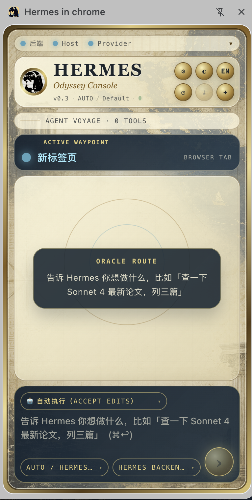

# Hermes in Chrome

[](./LICENSE)
[](https://github.com/huaqing0/Hermes--in--chrome/actions/workflows/ci.yml)
[](https://developer.chrome.com/docs/extensions/mv3/intro/)
[](./docs/windows.md)

> An AI agent that lives in your Chrome sidebar and works on the live web in front of you: summarize videos, explain articles / papers / posts, inspect creator dashboards, open specific content, and operate forms or accounts after your approval.
>
> [中文版 →](./README.zh.md)

> **Status**: early preview. **macOS + Chrome** is the primary supported runtime. **Windows + Chrome** is experimental — Native Messaging host registration, backend startup, and `save_to_local` are implemented but still need real Windows validation. Linux is not yet supported.



## What it does

Use Hermes for tasks that are awkward for a normal chat agent because they depend on the page, video, account, or dashboard already open in your browser:

- **Summarize the current video**: "Summarize this YouTube / Bilibili video, list the key moments, and give me timestamps."
- **Explain the page in context**: "Explain this article / paper / forum post. What is the main claim, what evidence does it use, and what should I pay attention to?"
- **Analyze creator analytics**: "Open my creator studio and analyze why this video performed this way from views, retention, traffic sources, and comments."
- **Find and open content**: "Open that interview clip where the guest talks about browser agents" or "jump this video to 40:50."
- **Operate logged-in sites**: "Draft a tweet from this thread and publish it after I approve" or "fill this form from the data on the current page."

The agent can read the current page, open its own tab group, inspect dynamic interfaces, take real screenshots via Chrome DevTools Protocol, and type/click like a real user — all while you keep working in your own tabs.

## Why Hermes

- **Stay on the page** — ask the AI while you are watching a video, reading a paper, or looking at a creator dashboard. You do not need to switch to a separate AI chat window, paste links, upload screenshots, and explain the page context again.
- **Works with non-vision models** — Hermes exposes the page through accessibility trees, browser state, tool results, and optional screenshot analysis, so text-only models such as DeepSeek can still understand and operate webpages.
- **A lightweight local alternative** — inspired by workflows like Claude in Chrome, but built as an independent local-first project. When Claude / Codex quota is tight, or a task feels too small for a premium coding/browser agent, you can run Hermes with cheaper tokens such as DeepSeek or any OpenAI-compatible provider.
- **Bring your own Hermes Agent** — this repository is the Chrome extension frontend. You still need [Hermes Agent](https://github.com/huaqing0/hermes-agent) installed and running locally.

## What you need

| Requirement | Where to get it |
|-------------|----------------|
| **Hermes Agent** v0.2.0+ | [github.com/huaqing0/hermes-agent](https://github.com/huaqing0/hermes-agent) — the backend that runs locally and powers the AI |
| **An LLM API key** | DeepSeek, Anthropic Claude, Google Gemini, OpenAI, or any OpenAI-compatible provider |
| **macOS or Windows** | macOS: full support. Windows: experimental (see below) |
| **Chrome** 116+ | [google.com/chrome](https://www.google.com/chrome/) |

No cloud account required — everything runs on your machine. Your API key talks directly to your chosen LLM provider.

> **License**: [MIT](./LICENSE).

## Three core capabilities

1. **Lives in the page** — a persistent Chrome sidepanel with streaming AI replies
2. **Sees the page in real time** — after each action the agent proactively `read_page`s the accessibility tree
3. **Opens its own tabs** — researches in series/parallel inside a dedicated Hermes Tab Group without disturbing you

## Architecture

```
sidepanel (React + Vite)
   ↑↓
Service Worker  ←→ WebSocket  ←→ Hermes Agent (Python)
   ├─ chrome.debugger (CDP: screenshot / click / type)
   ├─ chrome.tabGroups (per-session isolation)
   └─ content scripts (a11y-tree, injected into isolated world)
```

## Install

> **Before you start**: Install [Hermes Agent](https://github.com/huaqing0/hermes-agent) v0.2.0+. From the unzipped `hermes-in-chrome` folder, run the launcher when the sidepanel asks for the backend:
> ```bash
> npm run backend:ensure
> ```
> The launcher starts Hermes Agent with `HERMES_IN_CHROME_BACKEND_PATH` pointing at this package's `backend/` bridge. If you run `hermes gateway run` manually, set that environment variable yourself.

### Quick start (no dev tools needed)

1. Go to [Releases](https://github.com/huaqing0/Hermes--in--chrome/releases) → download `hermes-in-chrome.zip`
2. Unzip → open `chrome://extensions` → enable **Developer mode** → **Load unpacked** → pick the unzipped `hermes-in-chrome/` folder
3. Press `Cmd+H` on macOS / `Ctrl+H` on Windows to open the sidepanel → follow the status bar prompts

### Dev install (for contributors)

1. **Clone + build**:

   ```bash
   git clone https://github.com/huaqing0/Hermes--in--chrome.git
   cd hermes-in-chrome
   npm install && npm run build
   ```

2. **Load the extension in Chrome**: open `chrome://extensions` → toggle **Developer mode** → click **Load unpacked** → pick the `dist/` directory generated above.

3. **Press `Cmd+H` on macOS / `Ctrl+H` on Windows** to open the sidepanel — then **follow the prompts in the status bar at the top**. You don't need to copy your extension ID by hand or hunt for command names in the README.

The status bar walks you through:

- ① start the local Hermes backend (one-click copy of `npm run backend:ensure`)
- ② register the Native Messaging host (your extension ID is pre-filled, copy the whole command in one click)
- ③ pick a provider / paste an API key (or use OAuth)

Once all three turn green the bar collapses to a single line `● Backend ● Host ● Provider`. Click to re-expand.

## Themes

Two built-in themes; the first button in the header toggles them:

- **CP2077 Dystopia** — static yellow-black hazard frames, Rajdhani industrial type, octagonal clipped components
- **80s Synthwave** — animated neon edge flow, magenta/cyan gradients, Orbitron + VT323 type, Tron perspective grid

Theme is persisted in `chrome.storage.local`.

## Language

Sidepanel UI ships with **runtime zh/en switching**. The header button (`EN` while showing Chinese, `中` while showing English) flips the whole UI instantly. Default follows `chrome.i18n.getUILanguage()`. Persisted in `chrome.storage.local`.

Extension name / description on `chrome://extensions` follow your browser UI language via Chrome's standard `_locales`.

## Providers and models

The sidepanel supports provider + model two-level selection. Click the gear ⚙ button to open settings.

**API Key providers**: DeepSeek / Anthropic Claude / Google Gemini / xAI Grok / Alibaba DashScope (Qwen) / Kimi (Moonshot) / Z.ai (GLM) / MiniMax / Custom OpenAI-compatible

**OAuth providers**: OpenAI Codex / Qwen OAuth / Google Gemini CLI / MiniMax OAuth / Nous Portal — click "Log in" and it opens the device-code URL, the extension polls for completion.

**Auto**: defaults to whatever the Hermes backend has configured (no override from the frontend).

### Two ways to configure an API key

**Recommended: keep keys on the backend** (never enter `chrome.storage`, never enter the conversation log):

```bash
cp .env.example ~/.hermes/.env
# Edit ~/.hermes/.env and paste your keys
```

`.env.example`:

```bash
DEEPSEEK_API_KEY=...
ANTHROPIC_API_KEY=...
GOOGLE_API_KEY=...
XAI_API_KEY=...
DASHSCOPE_API_KEY=...
KIMI_API_KEY=...
GLM_API_KEY=...
MINIMAX_API_KEY=...
```

**Frontend override**: gear ⚙ → pick provider → fill API Key / Base URL → **Test connection** (actually pings the provider, surfaces 401/403) → Save.

Frontend-overridden keys are stored only in `chrome.storage.local` and sent only to the `127.0.0.1` local backend. They **never** enter the conversation log or this repo.

### Custom / Local

Works with Ollama, vLLM, LM Studio, any private OpenAI-compatible gateway: pick `Custom / Local` → fill Base URL + Model ID + optional API Key.

## Tool set

Core browser tools:

`fetch_url` · `tabs_context` · `read_page` · `find` · `click` · `hover` · `right_click` · `double_click` · `drag` · `type` · `key` · `scroll` · `scroll_to` · `navigate` · `open_tab` · `close_tab` · `screenshot` · `visual_inspect` · `wait` · `browser_batch` · `get_console_logs` · `read_network_requests` · `save_to_local` · `extract_markdown`

- `read_page` and `ref_id` operations run via `chrome.scripting.executeScript`'s **isolated world** so the a11y tree is never exposed to the page's main world
- `browser_batch` collapses predictable consecutive actions to cut tool-call round-trips
- `key` supports combos like `Meta+Enter` for keyboard-submit on X / Twitter
- `type` uses the clipboard temporarily for rich-text fields on X / YouTube etc., and restores the clipboard afterwards. If restore has to downgrade to plain text or fails, the result includes `clipboard_restore_mode`
- `visual_inspect` routes a page screenshot through a real vision channel: vision-capable GPT / Claude / Gemini models receive the image natively; text-only models use Hermes `auxiliary.vision` and receive a short text analysis.
- `save_to_local` writes any text/binary content anywhere the user has filesystem permission (except system paths and sensitive user dirs — see [Save scraped content locally](#save-scraped-content-locally-native-messaging) below); needs a one-time install. `extract_markdown` turns the current Chrome page into Markdown — typical pair with `save_to_local` for "scrape page + persist".

## Save scraped content locally (Native Messaging)

`save_to_local` lets the agent persist `fetch_url` HTML, `read_page` a11y trees, `screenshot` PNGs, `extract_markdown` output, etc. The path can be **anywhere on your filesystem** (`~/Downloads/`, `C:\Users\you\Downloads\`, `/Volumes/external-ssd/`, `/tmp/`, etc.) — **no configuration required**. Chrome extensions can't write files directly, so this goes through Native Messaging to a small local Python process `hermes-filewriter.py`.

**First-time install (one-shot)**: easiest path is to follow the prompt in the sidepanel's onboarding status bar — it auto-fills your extension ID and the project path. If you'd rather do it by hand:

1. Copy your Hermes in chrome ID from `chrome://extensions` (32 lowercase letters a-p)
2. Register the Native Messaging host:

   ```bash
   npm run native-host:install -- <your-extension-id>
   ```

What this does:

- Copies `scripts/hermes-filewriter.py` to the per-user Hermes native-messaging directory (`~/.hermes/native-messaging/` on macOS, `%USERPROFILE%\.hermes\native-messaging\` on Windows)
- macOS: writes a host manifest to `~/Library/Application Support/Google/Chrome/NativeMessagingHosts/com.hermes.filewriter.json` with your extension ID in `allowed_origins`
- Windows experimental: writes the manifest to `%USERPROFILE%\.hermes\native-messaging\com.hermes.filewriter.json` and registers `HKCU\Software\Google\Chrome\NativeMessagingHosts\com.hermes.filewriter`
- Records the repo root to `~/.hermes/hermes-in-chrome.json` on macOS or `%USERPROFILE%\.hermes\hermes-in-chrome.json` on Windows so the sidepanel can emit fully-resolved `cd ...` / PowerShell `Set-Location ...` one-liners
- Reload the extension on `chrome://extensions` afterwards

**Security boundary**:

- Host accepts absolute paths and expands `~`. Writes are allowed anywhere on the user filesystem **except** system paths (`/System`, `/usr`, `/etc`, `/Library/Apple`, `C:\Windows`, `C:\Program Files`, etc.) and sensitive user dirs (`~/.ssh`, `~/.aws`, `~/.gnupg`, browser profiles, shell rc files, PowerShell profile files, etc.). This blocks prompt-injection attempts to steal credentials or hijack a shell.
- Refuses to overwrite existing files unless the tool call explicitly passes `overwrite=true`
- Native Messaging request envelope is capped at 64 MiB; base64 binary payloads must account for encoding overhead when computing total size.
- Host responses stay tiny and below Chrome's 1 MiB native-host-to-extension limit.
- Log at `~/.hermes/logs/hermes-filewriter.log` on macOS or `%USERPROFILE%\.hermes\logs\hermes-filewriter.log` on Windows

**Typical use**:

```text
ext_extract_markdown()                # returns {url, title, markdown}
→ ext_save_to_local(path="~/Downloads/page.md", content=<step-1.markdown>)

ext_screenshot()                      # returns base64
→ ext_save_to_local(path="~/Downloads/page.jpg", content=<base64>, encoding="base64")
```

## Privacy & Permissions

This extension is **local-first**. Nothing in the conversation, the page DOM, screenshots, or your API keys is sent to anywhere other than `127.0.0.1:8642` (your local Hermes Agent). Your LLM provider of choice receives only what the Hermes backend explicitly relays. `visual_inspect` sends screenshots to the active vision provider or your configured Hermes `auxiliary.vision` provider.

The MV3 manifest requests these permissions, each for a specific reason:

| Permission | Why we need it |
|------------|----------------|
| `sidePanel` | Render the chat UI in Chrome's sidebar |
| `storage` | Persist theme / language / API key overrides locally |
| `activeTab`, `tabs` | Read the URL/title of the current tab so the agent has context |
| `scripting` | Inject `a11y-tree.ts` (isolated world) so the agent can see the page DOM as structured data |
| `debugger` | Drive the page via Chrome DevTools Protocol (real screenshots, real Cmd+V paste, real mouse clicks). Required for any tool that **acts** on a page rather than just reads it |
| `tabGroups` | Group agent-opened tabs into a dedicated "Hermes" group so research doesn't pollute your workspace |
| `webNavigation` | Detect when an agent-driven page finishes loading before reading it |
| `alarms`, `offscreen` | Keep the service worker alive for in-flight LLM streams; the offscreen document hosts clipboard read/write for rich-text input |
| `notifications` | Surface long-running task completion / errors |
| `clipboardRead`, `clipboardWrite` | Snapshot your clipboard before pasting rich text into X / YouTube etc., then restore it. **Clipboard contents are never sent off-device.** When full snapshot/restore isn't supported the result is marked `clipboard_restore_mode: 'text'`; if restore fails it is marked `clipboard_restore_mode: 'failed'` |
| `nativeMessaging` | Talk to `hermes-filewriter` (a separate Python process) to persist files locally. Without this `save_to_local` is unavailable |
| `host_permissions: <all_urls>` | The agent needs to operate on any URL you point it at; we can't predict in advance which sites you'll use |

For a fuller security review, see [Threat model](./docs/threat-model.md).

What we do **not** do:

- No analytics, telemetry, or external tracking beacons
- No third-party CDN or web font (sidepanel uses system fonts only)
- No background page activity when the sidepanel is closed beyond the WebSocket heartbeat to your local Hermes backend
- The `debugger` permission triggers Chrome's "this browser is being controlled by a debugger" banner whenever the agent is running — that's normal and you can always click the banner to stop

## Dependencies and limits

**This is a Chrome extension frontend**; it needs a backend:

- **macOS + Chrome** is the primary supported runtime. **Windows + Chrome** is experimental; Native Messaging host registration, local filewriter support, and backend startup are implemented but still require real Windows validation. Linux is not supported yet.
- **Backend**: [Hermes Agent](https://github.com/huaqing0/hermes-agent) (third-party project, maintained separately), listening on `127.0.0.1:8642`, exposing `/api/ws/extension`
- The 5 provider handlers (`provider_status` / `provider_validate` / `provider_auth_start` / `provider_auth_poll` / `provider_logout`) and the browser tool bridge need to be registered inside Hermes Agent
- The extension itself **cannot** spawn local Python processes; run `npm run backend:ensure` from your terminal, or `npm run backend:watch` for a foreground watchdog
- We only ask for `clipboardRead` / `clipboardWrite` for local rich-text input (snapshot original → write payload → restore). Clipboard contents are never sent to a remote service.

### Hermes Agent bridge requirement

The extension's browser tools (`click`, `type`, `read_page`, etc.) rely on a Python bridge (`backend/browser_extension_tools.py`) that must be importable by the Hermes Agent gateway. The built-in launcher (`npm run backend:ensure`) sets `HERMES_IN_CHROME_BACKEND_PATH` automatically.

**Verify the bridge is working:**

```bash
npm run check-bridge
```

This checks that:
- The Hermes gateway is healthy at `http://127.0.0.1:8642/health`
- `HERMES_IN_CHROME_BACKEND_PATH` points to a directory containing `browser_extension_tools.py`
- The gateway log confirms the bridge was loaded without errors

If the check fails, re-run `npm run backend:ensure` — it passes the correct path to the gateway automatically.

### WebSocket protocol contract

The extension talks to the backend over WebSocket; message shapes live in [`src/types/messages.ts`](./src/types/messages.ts). You could in principle write a compatible backend in place of Hermes Agent, as long as it implements:

- `hello` / `user_message` / `tool_result` / `tool_error` / `stop` / `ping` (client → server)
- `thinking_delta` / `text_delta` / `tool_call` / `tool_approval_request` / `message_complete` / `error` / `provider_*_result` / `pong` (server → client)

### Windows support (experimental)

On Windows, the Native Messaging host is registered via the registry. **Node.js** and **Python 3** are required on PATH.

```powershell
# Install the host
npm run native-host:install -- <your-extension-id>

# Check status
npm run native-host:status

# Verify registry
reg query HKCU\Software\Google\Chrome\NativeMessagingHosts\com.hermes.filewriter

# Uninstall
npm run native-host:uninstall
```

Backend startup uses the same `npm run backend:ensure` command (the venv Python path is `venv\Scripts\python.exe` on Windows).

**Known limitations**:
- Windows support is experimental and not fully tested
- Only Chrome is supported (Chromium-derived browsers may have different registry paths)
- Requires a real Windows + Chrome environment for validation

See [docs/windows.md](./docs/windows.md) for details.

---

## Known limitations

- macOS is the primary supported platform. Windows support is experimental; Linux is not yet supported.
- The extension requires a local Hermes Agent backend. It cannot run browser-agent tasks by itself.
- Hermes in Chrome is not published on the Chrome Web Store yet; install from a release zip or build from source.
- Chrome shows a debugger-control banner while the agent is driving a page. This is expected for tools that use Chrome DevTools Protocol.

## Project layout

```
src/
├── sidepanel/        # React UI (App.tsx, styles.css, i18n.ts, index.html)
├── background/       # Service Worker (WS, message routing, tab management)
├── content/          # Content scripts (a11y-tree.ts, visual-indicator.ts)
├── offscreen/        # Offscreen document (clipboard snapshot/restore)
├── types/            # TypeScript type definitions
└── manifest.json     # MV3 manifest
backend/              # Browser-tool bridge to be imported by Hermes Agent (Python)
scripts/              # Backend launcher, native host installer, filewriter
public/icons/         # Extension icons
_locales/             # Chrome i18n messages (manifest name/description)
```

## License

[MIT](./LICENSE)

Contributions: see [CONTRIBUTING.md](./CONTRIBUTING.md).

Security disclosures: see [SECURITY.md](./SECURITY.md).
